# Temporal Order Management Demo
Demos various aspects of [Temporal](http://tempora.io) using the [Go SDK](https://github.com/temporalio/sdk-go) for backend and [Python SDK](https://github.com/temporalio/sdk-python) for frontend.

| Prerequisites      |   | __ | Features       |   | __ | Patterns            |   | 
|:-------------------|---|----|----------------|---|----|---------------------|---|
| Network Connection |  | __  | Schedule       |  | __ | Entity              | ✅ |
| Golang 1.18+       | ✅ | __ | Local Activity |  ✅ | __ | Long-Running        | ✅ |
| Python 3.11        | ✅ | __ | Timer          | ✅ | __ | Fanout              | ✅ |
| Poetry 1.3.2       | ✅ | __ | Signal         | ✅ | __ | Continue As New     |   |
|                    | ✅ | __ | Query          | ✅ | __ | Manual Intervention | ✅ |
|                    | ✅ | __ | Update         | ✅ | __ | Saga                |   |
|                    |    | __ | Heartbeat      |  | __ | Long-polling        |   |
|                    | ✅ | __ | Retry          | ✅ | __ |                     |   |
|                    |   | __ | Data Converter |   | __ |                     |   |
|                    | ✅ | __ | Polyglot       | ✅ | __ |                     |   |


This demo walks through several scenarios using an order management process. The scenarios are:
- HappyPath
- AdvancedVisibility
- HumanInLoopSignal
- HumanInLoopUpdate
- ChildWorkflow
- APIFailure
- RecoverableFailure
- NonRecoverableFailure

# Run Worker
Ensure the following environment variables:
```bash
$ export TEMPORAL_HOST_URL=<namespace>.<accountId>.tmprl.cloud:7233
$ export TEMPORAL_MTLS_TLS_CERT=/home/ktenzer/temporal/certs/ca.pem
$ export TEMPORAL_MTLS_TLS_KEY=/home/ktenzer/temporal/certs/ca.key
$ export TEMPORAL_NAMESPACE=<namespace>.<accountId>
$ export TEMPORAL_WORKER_METRICS_PORT=9090
$ export TEMPORAL_TASK_QUEUE=orders
```

```bash
$ go run worker/main.go 

2024/02/20 14:05:20 prometheus metrics scope created
2024/02/20 14:05:20 INFO  No logger configured for temporal client. Created default one.
2024/02/20 14:05:21 INFO  Started Worker Namespace helloworld.sdvdw TaskQueue orders WorkerID 485217@fedora@
```

# Run UI
Ensure the following environment variables:
```bash
$ export TEMPORAL_HOST_URL=<namespace>.<accountId>.tmprl.cloud:7233
$ export TEMPORAL_MTLS_TLS_CERT=/home/ktenzer/temporal/certs/ca.pem
$ export TEMPORAL_MTLS_TLS_KEY=/home/ktenzer/temporal/certs/ca.key
$ export TEMPORAL_NAMESPACE=<namespace>.<accountId>
$ export TEMPORAL_TASK_QUEUE=orders
```

Install [Poetry](https://python-poetry.org/)

Change to the UI directory
```bash
$ cd ui
```

Install Poetry Dependencies
```bash
$ poetry install --no-root
```

Run Flask App
```bash
$ poetry run python app.py

 * Serving Flask app 'app'
 * Debug mode: on
WARNING: This is a development server. Do not use it in a production deployment. Use a production WSGI server instead.
 * Running on http://127.0.0.1:5000
Press CTRL+C to quit
 * Restarting with stat
 * Debugger is active!
 * Debugger PIN: 685-645-739
```

# Happy Path
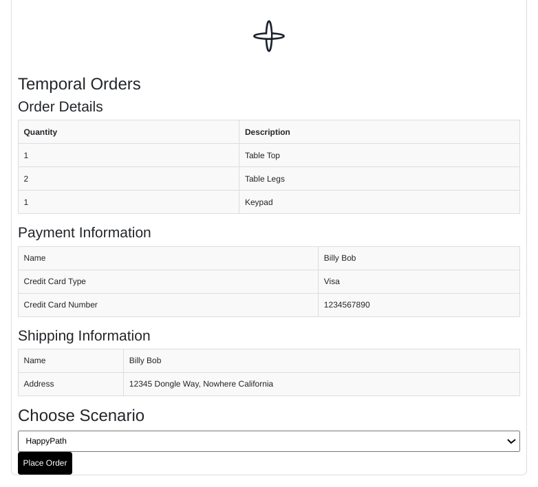

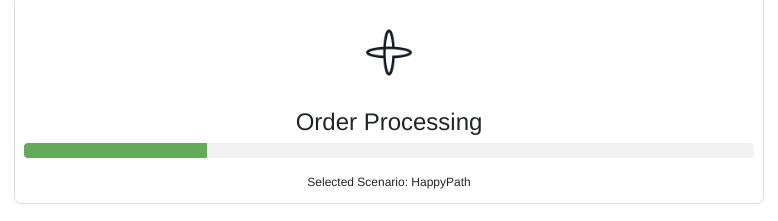

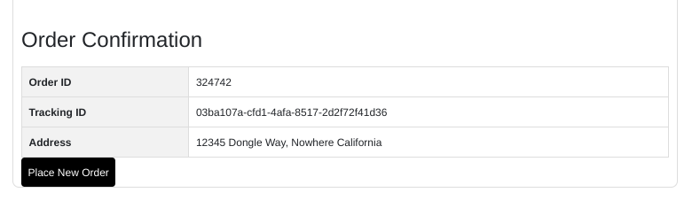

The happy path demonstrates the base functionality that is consistent across all other scenarios. In this demo you will place an order for various items that make a table. The workflow will generate a trackingId using a Temporal Side Effect. 

The workflow will execute a side effect:
- getTrackingId

Shows how to handle simple non-deterministic code that cannot fail.

The workflow will expose two queries:
- getItems
- progress

The getItems query shows the list of items that are part of order. 

The progress query is used by the status bar in the UI to show progress. As workflow progress, progress is updated accordingly.

The workflow will execute one local activity:
- GetItems
The GetItems activity is used to get the items that need to be shipped as part of order in deterministic way. Lists in Go are not deterministic and as such should be properly sorted.

The workflow will execute several activities: 
- CheckFraud
- PrepareShipment
- ChargeCustomer
- ShipOrder

The items just simulate reaching out to a service. They simply print that they are doing what they are supposed to do. The ChargeCustomer activity is used for failure scenarios. The ShipOrder activity will batch and execute parallel activities for every item in the order that needs to ship. The workflow will await until all are completed.

# Advanced Visibility


This scenario follows Happy Path and in addition shows search attributes to increase workflow visibility. When executing workflow a search attribute is upserted which keeps track of the state of the workflow. In order to use this scenario ensure the following:
- A search attributed called OrderStatus with type Keyword is defined for your namespace
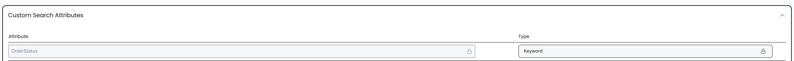
- The OrderStatus custom search attribute field is added to your workflows UI panel
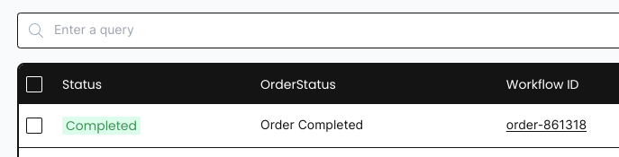

# Human in the Loop Signal


This scenario follows Happy Path and in addition adds human in the loop. During the order processing you are asked to update the order with a new address. The address you provide is sent and updated in the workflow using a signal. The signal is fire and forget with no validation. You have 30 seconds to submit an updated address otherwise the workflow will timeout. The timeout is done using an asynchronous timer. This scenario also shows how to use Go coroutines with Temporal as both the timer and the signal are coroutines.

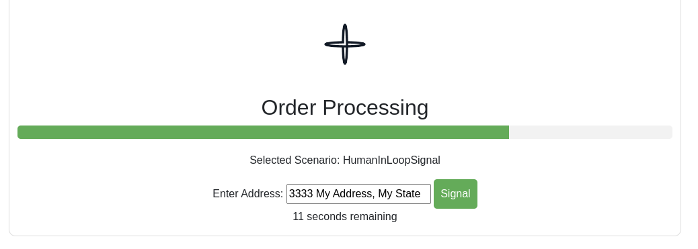

# Human in the Loop Update
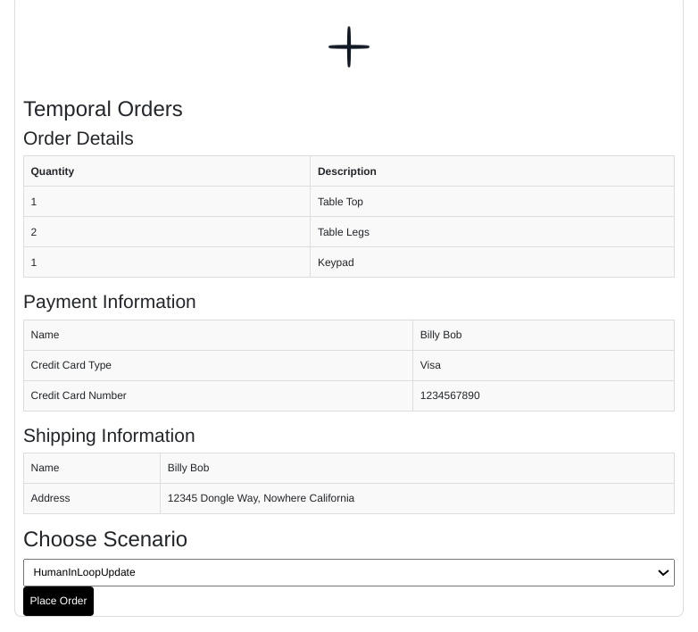

This scenario follows Happy Path and in addition adds human in the loop. During the order processing you are asked to update the order with a new address. The address you provide is sent and updated in the workflow using a update. The update allows for validation and if you send an address that doesn't start with a number validation will fail and an error is shown. You have 30 seconds to submit an updated address otherwise the workflow will timeout. The timeout is done using an asynchronous timer. This scenario also shows how to use Go coroutines with Temporal as both the timer and the update are coroutines.

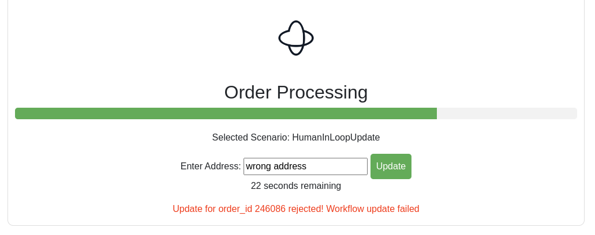

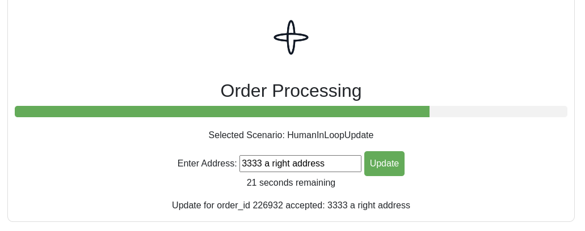

# Child Workflow


This scenario follows Happy Path but instead of shipping the items using parallel activities it does so using child workflows instead.

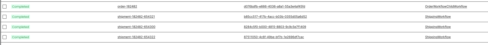

# API Failure


This scenario follows Happy Path, however after instead of executing ChargeCustomer this workflow will execute ChargeCustomerAPIFailure which will fail and on 5th attempt succeed. This scenario shows how Temporal workflows handle failures from activities.

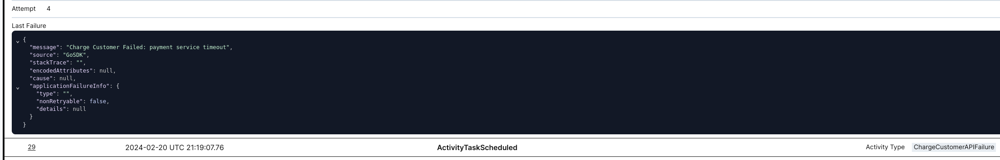

# Recoverable Failure
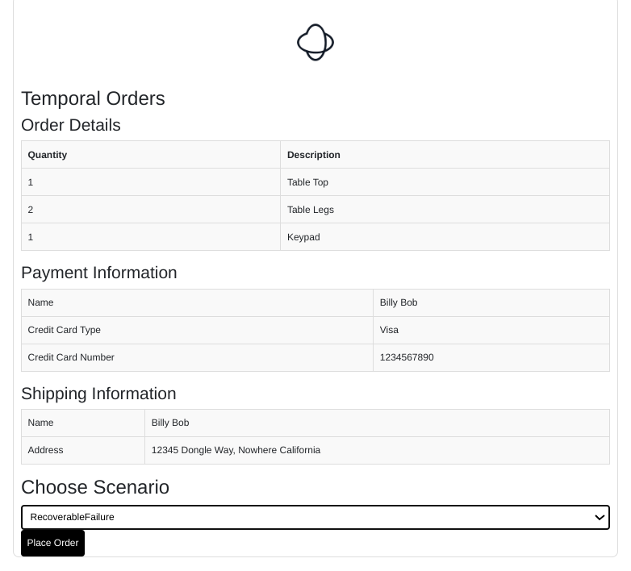

This scenario follows Happy Path, however after ChargeCustomer activity executes a divide by zero bug is introduced. Simply comment-out the divide by zero code in OrderWorkflowREcoverableFailure.go and restart worker. Temporal will perform a replay, recover state of the workflow and proceed exactly where it left of as if nothing happened.

Before starting scenario uncomment following code in OrderWorkflowRecoverableFailure.go:
```go
Divide(1, 0)
```

# Non Recoverable Failure
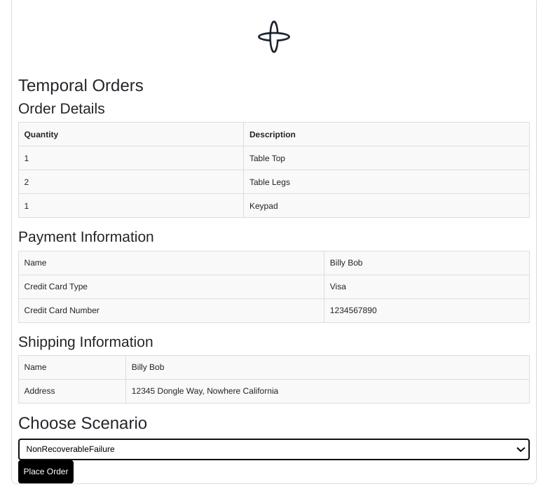

This scenario follows Happy Path, however after instead of executing ChargeCustomer this workflow will execute ChargeCustomerNonREcoverableFailure activity. This activity throws a non-retryable application error which causes the workflow to fail.

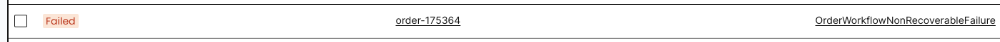
