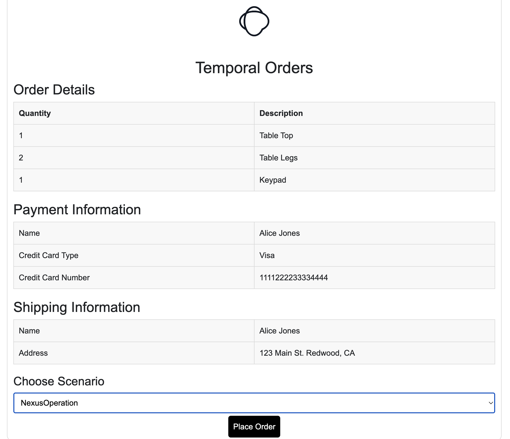
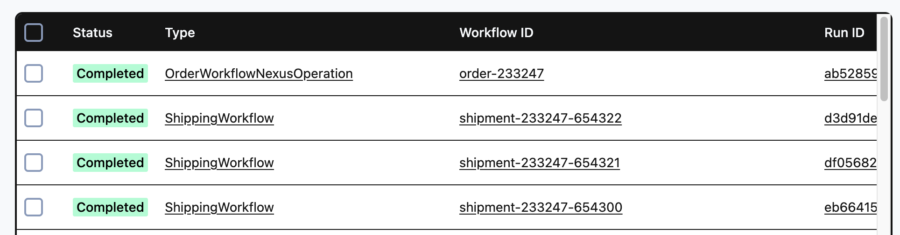
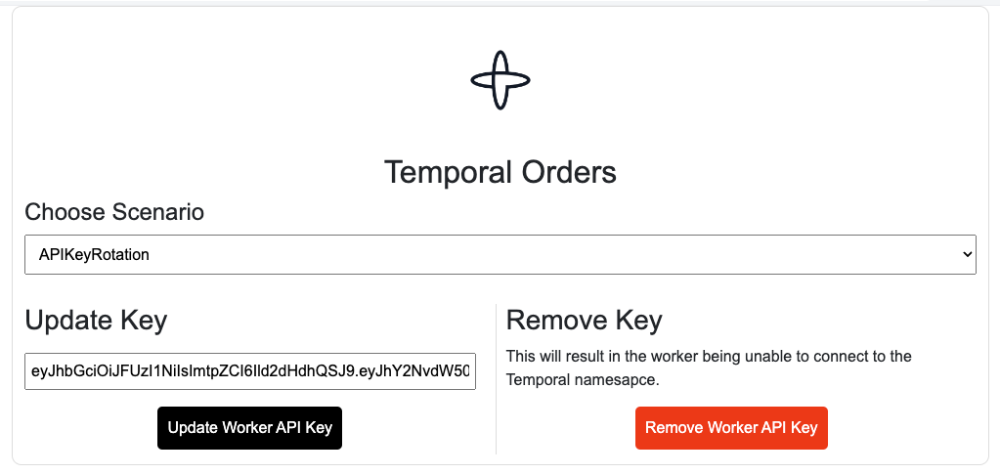

# Temporal Order Management Demo
Demos various aspects of [Temporal](http://temporal.io) through an example Order Management worfklow implementation.

| Prerequisites      |    | __ | Features       |   | __ | Patterns            |   |
|:-------------------|--- |----|----------------|---|----|---------------------|---|
| Network Connection |    | __  | Schedule      |    | __ | Entity              | __ |
| Golang 1.24+       | ✅ | __ | Local Activity | ✅ | __ | Long-Running        | __ |
| Python 3.12+       | ✅ | __ | Timer          | ✅ | __ | Fanout              | ✅ |
| uv 0.9+            | ✅ | __ | Signal         | ✅ | __ | Continue As New     |    |
| Node 22+           | ✅ | __ | Query          | ✅ | __ | Manual Intervention | ✅ |
| .Net 8+            | ✅ | __ | Update         | ✅ | __ | Saga                | ✅ |
| Java 21+           | ✅ | __ | Heartbeat      |    | __ | Long-polling        |    |
| Ruby 3.4+          | ✅ | __ | Retry          | ✅ | __ |                     |    |
|                    |    | __ | Data Converter |    | __ |                     |    |
|                    |    | __ | Polyglot       | ✅ | __ |                     |    |
|                    |    | __ | API Keys       | ✅ | __ |                     |    |

> [!TIP]
> ***The runtimes identified in the Prerequisites column can be easily installed using [asdf](#asdf)***

This demo walks through several scenarios using an order management process. The scenarios are:
- HappyPath
- AdvancedVisibility
- HumanInLoopSignal
- HumanInLoopUpdate
- ChildWorkflow
- NexusOperation
- APIFailure
- RecoverableFailure
- NonRecoverableFailure

This demo can be run against a Local Temporal Dev Server, or Temporal Cloud.

# Local Dev Server Setup

## Start the server
```bash
cd ui
./starttemporalserver.sh
```

## (Optional) Create Nexus Endpoint
```bash
temporal operator namespace create --namespace nexus-demo

temporal operator nexus endpoint create \
    --name shipping-endpoint \
    --target-task-queue shipping \
    --target-namespace nexus-demo
```

## Run Worker
```bash
cd <sdk>
./startlocalworker.sh
```

## (Optional) Run Worker for Nexus Service
```bash
cd <sdk>
./startlocalworker_nexus.sh
```

## Run Web UI
```bash
cd ui
./startlocalwebui.sh
```

# Temporal Cloud Setup

## Configure Your Namespace in Your Temporal Cloud Account
* Choose mTLS or API Key authentication
* Create Search Attribute `OrderStatus` as `Keyword` through UI or tcld CLI
```bash
tcld namespace search-attributes add \
    -n <namespace>.<accountId> \
    --sa "OrderStatus=Keyword"
```

## Set Your Environment for Cloud
```bash
cp setcloudenv.example setcloudenv.sh
vi setcloudenv.sh # edit as needed
```

# (Optional) Create Nexus Endpoint for Cloud
```bash
tcld nexus endpoint create \
    --name <your-shipping-endpoint> \
    --target-task-queue shipping \
    --target-namespace <namespace>.<accountId> \
    --allow-namespace <namespace>.<accountId>
```

## Run Worker
```bash
cd <sdk>
./startcloudworker.sh
```

## (Optional) Run Worker for Nexus Service
```bash
cd <sdk>
./startcloudworker_nexus.sh
```

## Run Web UI
```bash
cd ui
./startcloudwebui.sh
```

# Scenarios

## Happy Path


The happy path demonstrates the base functionality that is consistent across all other scenarios. In this demo
you will place an order for various items that make a table.

Shows how to handle simple non-deterministic code that cannot fail.

The workflow will expose two queries:
- getItems
- progress

The getItems query shows the list of items that are part of order.

The progress query is used by the status bar in the UI to show progress. As workflow progress, progress is updated accordingly.

The workflow will execute one local activity:
- GetItems
The GetItems activity is used to get the items that need to be shipped as part of order in deterministic way. Lists in Go are
not deterministic and as such should be properly sorted.

The workflow will execute several activities:
- CheckFraud
- PrepareShipment
- ChargeCustomer
- ShipOrder

The items just simulate reaching out to a service. They simply print that they are doing what they are supposed to do. The
ChargeCustomer activity is used for failure scenarios. The ShipOrder activity will batch and execute parallel activities
for every item in the order that needs to ship. The workflow will await until all are completed.

## Advanced Visibility


This scenario follows Happy Path and in addition shows search attributes to increase workflow visibility. When executing
workflow a search attribute is upserted which keeps track of the state of the workflow. In order to use this scenario ensure
the following:
- A search attributed called OrderStatus with type Keyword is defined for your namespace

- The OrderStatus custom search attribute field is added to your workflows UI panel


## Human in the Loop Signal


This scenario follows Happy Path and in addition adds human in the loop. During the order processing you are asked to
update the order with a new address. The address you provide is sent and updated in the workflow using a signal. The
signal is fire and forget with no validation. You have 30 seconds to submit an updated address otherwise the workflow
will timeout. The timeout is done using an asynchronous timer.


## Human in the Loop Update


This scenario follows Happy Path and in addition adds human in the loop. During the order processing you are asked to
update the order with a new address. The address you provide is sent and updated in the workflow using a update. The update
allows for validation and if you send an address that doesn't start with a number validation will fail and an error is shown.
You have 30 seconds to submit an updated address otherwise the workflow will timeout. The timeout is done using an
asynchronous timer.


## Child Workflow


This scenario follows Happy Path but instead of shipping the items using parallel activities it does so using child
workflows instead.


## NexusOperation


This scenario follows Happy Path but instead of shipping items using parallel activities or Child Workflows, it does so
using Nexus Operations to trigger the Shipping Workflow.

> [!NOTE]
> This scenario is currently only supported using Go and Java.



## API Failure


This scenario follows Happy Path, however after instead of executing ChargeCustomer this workflow will execute
ChargeCustomerAPIFailure which will fail and on 5th attempt succeed. This scenario shows how Temporal workflows handle
failures from activities.


## Recoverable Failure


This scenario follows Happy Path, however after ChargeCustomer activity executes a bug is introduced. Simply comment-out
the buggy code in OrderWorkflowREcoverableFailure.go and restart worker. Temporal will perform a replay, recover state of
the workflow and proceed exactly where it left of as if nothing happened.

## Non Recoverable Failure


This scenario follows Happy Path, however after instead of executing ChargeCustomer this workflow will execute
ChargeCustomerNonREcoverableFailure activity. This activity throws a non-retryable application error which causes the
workflow to fail.


## Live API Key Rotation


> [!NOTE]
> This scenario is currently only supported using Go and Typescript.

This scenario demonstrates updating the API key for the worker without the need to restart the worker. Steps;
1. Invalidate the worker API key with `Remove Worker API Key`
    - This doesn't disable/revoke the key with the Temporal server, it just sets a blank key on the worker.
    - Alternatively, you could diable/revoke the key on the Temporal server.
2. Start the `HappyPath` scenario. The workflow will fail to make progress.
3. In a new browser tab/window, open the Order Management UI (http://127.0.0.1:5000) and update the worker API key.
    - The predefined value in the `Update Key` text field is the value of the `TEMPORAL_API_KEY` environment variable.
    If you used `Remove Worker API Key` earlier, then this key will still work fine.
    - Alternatively, if you have disabled/revoked the key on the Temporal server then you will need to make sure you provide
    a vaild key here.
4. Return to the in-flight `HappyPath` scenario. The workflow will now progress/complete.

# ASDF

The runtime versions for the prerequisites identified in this README can be managed
using [asdf](https://asdf-vm.com/). The runtime versions are specified in the [.tool-versions](.tool-versions)
file.

## Install & Configure

Install and configure `asdf` per the [Getting Started Guide](https://asdf-vm.com/guide/getting-started.html#getting-started)

## Install Plugins

Add [plugins](https://asdf-vm.com/manage/plugins.html) for the tools in [.tool-versions](.tool-versions)
```sh
asdf plugin add dotnet
asdf plugin add golang
asdf plugin add java
asdf plugin add nodejs
asdf plugin add python
asdf plugin add ruby
asdf plugin add uv
```

## Install Tool Versions
```sh
asdf install
```
